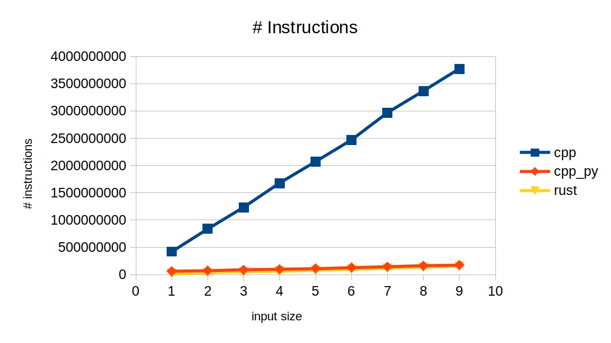

# iostream is hopeless
This repo details one of my frustrations with C++: poor performance and design of the `iostream` library.

## How so?
`iostream` is too convoluted and difficult to use. Let's say we want to read the entire content of a file into memory. In Python, this can be achieved by
```python
with open(file, 'rb') as f:
    buf = f.read()
```
Simple, easy, intuitive, short, sweet. What about Rust?
```rust
let mut ifs = File::open(file)?;
ifs.read_to_end(&mut buf)?;
```
Again, easy, intuitive, short, and sweet. Finally C++
```c++
std::ifstream ifs{file};
std::vector<char> buf{std::istreambuf_iterator<char>{ifs}, {}};
```
Clunky and convoluted. Am I supposed to memorize this? OK, maybe not as easy or intuitive as others, but I will be fine with it as long it does the job. Let's see how it performs.


Here, `cpp_py` is when we call Python for reading the file. This is crazy how much faster this is then using `iostream`.

In summary, here is the takeaway on iostream library for C++
- convoluted, difficult, and not intuitive APIs
- runs 5x slower and requires 10x more instructions compared to Rust/Python

Honestly, I think `iostream` is tainting the reputation of C++, scaring away newcomers. Can we still claim that the C++ is suitable for efficient and high-performance applications? Haven't we, the C++ community, been making fun of Python for being way too slow? It looks like now C++ needs Python to speed things up.

## Try it yourself
```bash
$ cmake -DCMAKE_CXX_FLAGS=-O3 -Bbuild
$ make -j -Cbuild
$ bash run_benchmark.sh
```

